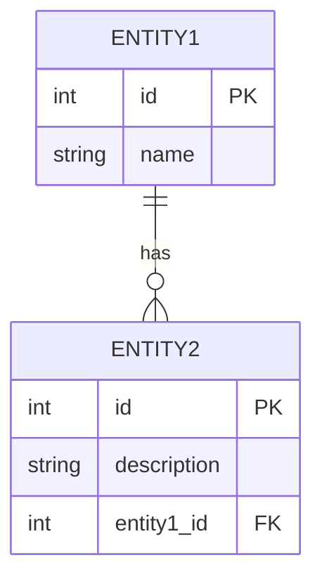

# 数据库设计文档

## 文档信息

| 项目名称 | 文档版本 | 创建日期 | 作者 |
|---------|---------|---------|------|
| [项目名称] | v0.1 | [日期] | [作者] |

## 1. 数据库选型

| 项目 | 选择 | 理由 |
|------|------|------|
| 关系型数据库 | [选型] | [理由] |
| 缓存数据库 | [选型] | [理由] |
| 其他存储 | [选型] | [理由] |

## 2. ER 图（实体关系描述）

<!-- 此处可嵌入 ER 图 -->

### 实体列表

| 实体名称 | 说明 | 核心字段 |
|---------|------|---------|
| [实体A] | [说明] | [字段] |
| [实体B] | [说明] | [字段] |

## 3. 表结构设计

### 3.1 [表名]

| 字段名 | 数据类型 | 长度 | 主键 | 非空 | 默认值 | 说明 |
|-------|---------|------|------|------|-------|------|
| id | INT/BIGINT | [长度] | Y | Y | AUTO_INCREMENT | 主键ID |
| [字段] | [类型] | [长度] | N | Y/N | [默认] | [说明] |
| created_at | DATETIME | - | N | Y | CURRENT_TIMESTAMP | 创建时间 |
| updated_at | DATETIME | - | N | Y | CURRENT_TIMESTAMP ON UPDATE | 更新时间 |

### 3.2 [表名]
<!-- 同上结构 -->

## 4. 索引设计

| 索引名称 | 表名 | 索引字段 | 类型 | 说明 |
|---------|------|---------|------|------|
| idx_[名称] | [表] | [字段] | 普通/唯一/全文 | [说明] |

## 5. 存储过程 / 触发器

| 名称 | 类型 | 说明 | SQL |
|------|------|------|-----|
| [名称] | 存储过程/触发器 | [说明] | [SQL] |

## 6. 数据迁移方案

### 6.1 初始化数据
<!-- 描述系统初始化需要导入的数据 -->

### 6.2 迁移脚本
| 版本 | 脚本名 | 说明 | 执行状态 |
|------|-------|------|---------|
| v1.0 | [脚本] | [说明] | 待执行/已执行 |

---

## 版本历史

| 版本 | 日期 | 修改内容 | 修改人 |
|------|------|---------|-------|
| v0.1 | [日期] | 初稿 | [作者] |
