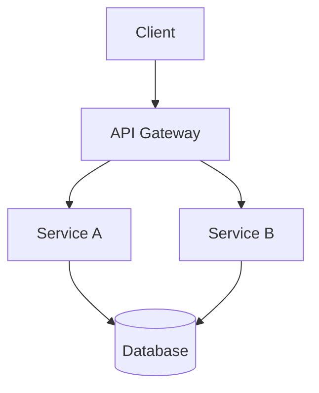
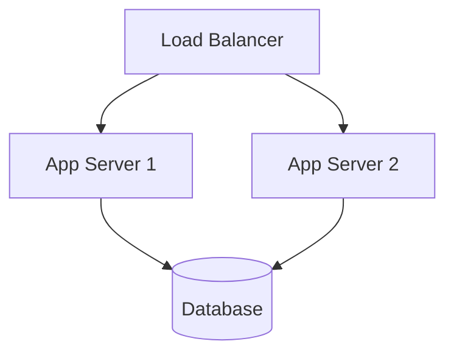

# 架构设计图

## 文档信息

| 项目名称 | 文档版本 | 创建日期 | 作者 |
|---------|---------|---------|------|
| [项目名称] | v0.1 | [日期] | [作者] |

## 1. 总体架构说明

<!-- 描述系统的总体架构风格（如微服务、分层架构、事件驱动等）和设计理念 -->

## 2. 分层架构

### 2.1 展现层
- **技术选型**：[技术]
- **职责**：[描述]
- **关键组件**：[组件列表]

### 2.2 应用层
- **技术选型**：[技术]
- **职责**：[描述]
- **关键组件**：[组件列表]

### 2.3 服务层
- **技术选型**：[技术]
- **职责**：[描述]
- **关键组件**：[组件列表]

### 2.4 数据层
- **技术选型**：[技术]
- **职责**：[描述]
- **关键组件**：[组件列表]

<!-- 此处可嵌入架构图（建议使用 PlantUML / Mermaid 等工具绘制） -->
<!--

-->

## 3. 模块间关系

```mermaid
graph LR
    [模块A] --> [模块B]
    [模块B] --> [模块C]
    [模块C] --> [模块D]
```

| 调用方 | 被调用方 | 通信方式 | 协议 |
|-------|---------|---------|------|
| [模块] | [模块] | 同步/异步 | [协议] |

## 4. 部署架构

| 节点 | 角色 | 配置 | 数量 |
|------|------|------|------|
| [节点] | [角色] | [配置] | [数量] |

### 4.1 部署拓扑（文字描述）
<!-- 描述各节点的网络拓扑关系、流量走向 -->



## 5. 架构决策记录

| 决策编号 | 决策内容 | 备选方案 | 决策理由 |
|---------|---------|---------|---------|
| ADR-001 | [决策] | [备选] | [理由] |
| ADR-002 | [决策] | [备选] | [理由] |

---

## 版本历史

| 版本 | 日期 | 修改内容 | 修改人 |
|------|------|---------|-------|
| v0.1 | [日期] | 初稿 | [作者] |
