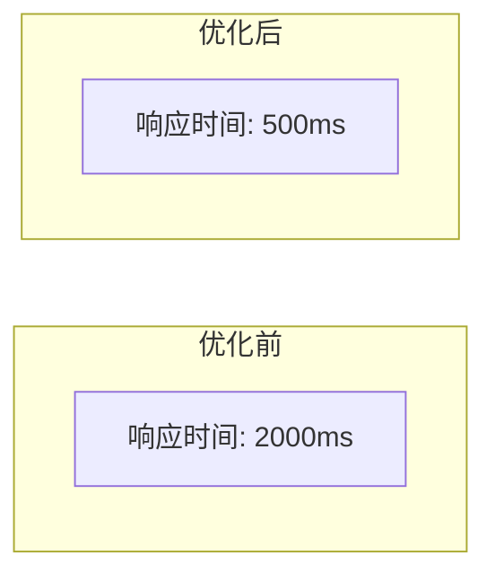

# 优化报告

## 文档信息

| 项目名称 | 文档版本 | 创建日期 | 作者 |
|---------|---------|---------|------|
| [项目名称] | v0.1 | [日期] | [作者] |

## 1. 优化背景

<!-- 描述为什么要进行本次优化（用户反馈、数据指标下滑、技术债务累积等） -->

## 2. 优化目标

| 指标 | 优化前值 | 目标值 | 衡量方法 |
|------|---------|-------|---------|
| [指标A] | [前值] | [目标] | [方法] |
| [指标B] | [前值] | [目标] | [方法] |

## 3. 优化方案

### 3.1 [优化项一]
- **问题定位**：[问题]
- **优化措施**：[措施]
- **涉及模块**：[模块]
- **工作量**：[人天]

### 3.2 [优化项二]
<!-- 同上结构 -->

## 4. 效果对比

| 指标 | 优化前 | 优化后 | 提升比例 | 是否达标 |
|------|-------|-------|---------|---------|
| [指标A] | [前值] | [后值] | [%] | 是/否 |
| [指标B] | [前值] | [后值] | [%] | 是/否 |

### 4.1 性能对比图（文字描述）
<!-- 可用 Mermaid 图表或文字描述优化前后变化趋势 -->

## 5. 后续建议

| 建议 | 预期收益 | 建议优先级 |
|------|---------|-----------|
| [建议] | [收益] | 高/中/低 |
| [建议] | [收益] | 高/中/低 |

---

## 版本历史

| 版本 | 日期 | 修改内容 | 修改人 |
|------|------|---------|-------|
| v0.1 | [日期] | 初稿 | [作者] |
